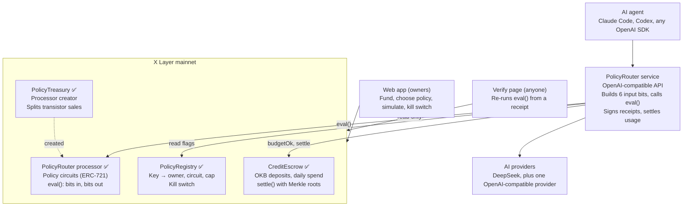

# Architecture

PolicyRouter has five parts: one off-chain router, two small contracts of our own, one TapeOut processor, and a web app. The processor is the part that makes rules immutable. Everything else feeds it the right bits and acts on its answer.

✅ = deployed on mainnet. Everything else is planned; see [BUILD_PLAN.md](../BUILD_PLAN.md).

## Status

| Part | Status | Where |
| --- | --- | --- |
| TapeOut processor + transistors | ✅ Live | [deployments.md](deployments.md) |
| PolicyTreasury | ✅ Live | [`contracts/src/PolicyTreasury.sol`](../contracts/src/PolicyTreasury.sol) |
| Budget Guard circuit | ✅ Live, circuit 1, verified 64/64 | [policies.md](policies.md) |
| Shared policy library (bits, netlists, templates) | ✅ Built | [`packages/policy`](../packages/policy) |
| PolicyRegistry, CreditEscrow | ✅ Live (100% line coverage) | [contracts.md](contracts.md), [deployments.md](deployments.md) |
| Router service | ✅ Chat completions, Responses (Codex) and Anthropic Messages (Claude Code). 101 unit and 17 fork integration tests; run live on mainnet with DeepSeek, and every receipt verified | [router.md](router.md) |
| Settler (Merkle roots) | ✅ Built, tested (crash recovery on a fork), first batch settled on mainnet | [router.md](router.md#settlement) |
| Other templates + policy simulation | ✅ Cheap Only, Small Requests and Strict live (circuits 2–4, 64/64 each); `GET /v1/simulate` built and tested | [policies.md](policies.md) |
| Web app | ✅ Built and tested end to end on a fork (Playwright); not hosted yet | [web.md](web.md) |
| Verify page | ✅ Built; verified real mainnet receipts with no wallet (desktop and phone); 8 E2E tamper and pending tests on a fork | [web.md](web.md#the-verify-page) |

## One request, start to finish

1. The agent calls `POST /v1/chat/completions` with its `pr-live-…` key and a model name.
2. The router looks up the key's circuit and escrow balance.
3. At one pinned block, it reads the kill switch (PolicyRegistry) and whether today's spend is under the cap (CreditEscrow).
4. It builds the input byte: model tier, size bucket, `budget_ok`, `kill`.
5. It calls `eval(circuitId, input)` on the processor. This is a free read-only call.
6. **Deny:** the router returns HTTP 403 `policy_denied` with a receipt. **Allow:** it forwards to the provider at the tier the circuit chose, which may be lower than requested.
7. It counts tokens, computes the cost, and returns the response with a signed receipt: key hash, circuit ID, input bits, output bits, block number, cost.
8. Every few minutes the settler debits CreditEscrow and posts a Merkle root of the batch's receipts on chain.

If `eval()` or a chain read fails, the router refuses the request: it **fails closed**.

## Trust model

The router is the only trusted piece, and everything it decides can be checked:

| What the router could do wrong | How it is caught |
| --- | --- |
| Serve a request the policy denies | The receipt's input and output bits can be re-run with `eval()` at the recorded block; receipts are signed and their Merkle root is on chain |
| Lie about the input bits | The receipt records the model requested and served; the owner can compare it with their agent's own logs |
| Overcharge | `settle` is capped by the balance and the daily cap; every receipt shows its cost |

The circuit makes cheating **detectable**, not impossible.

## Why the policy is a circuit

- **Immutable:** a taped-out circuit can never be changed. A new rule means a new circuit, and the key is pointed at it in PolicyRegistry. That change is an on-chain event anyone can see.
- **Free to check:** `eval()` is a `view` function, so the router can call it on every request, and anyone can re-run it, at no cost.
- **Small and inspectable:** Budget Guard is 8 NAND gates. Its whole netlist fits in 56 bytes and is stored on chain.
