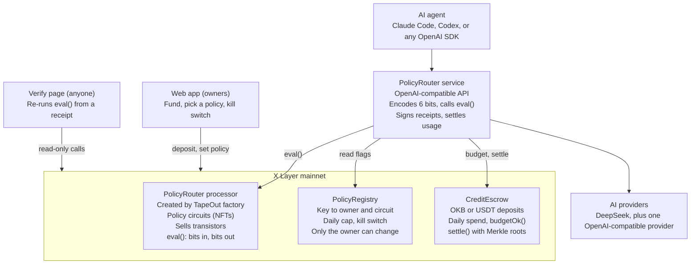

# PolicyRouter — Spec for the TapeOut Genesis Transistor Hackathon

Sep 30, 2026 · Christian Obi

> **Deployed:** the PolicyRouter processor is live on X Layer mainnet at `0x11FF9976c86E4C868a803Bc9B5E1ba7749226f99` (created by PolicyTreasury `0xad56De63a2F9F5f1170E9044046C15ee467b6288`), with Budget Guard taped out as circuit 1. See [docs/deployments.md](docs/deployments.md).

## Summary

**PolicyRouter is the immutable firewall for AI agents.** Every AI request goes through a policy circuit that answers allow, deny or downgrade, and the circuit lives on X Layer as a TapeOut circuit, so nobody can change a rule once it is set, including the agent, the owner mid-task, and the router operator. Model routing is a consequence of the firewall, not the headline.

The analogy: a traditional firewall runs `request → rules → allow/deny`. PolicyRouter runs `AI request → TapeOut policy → allow / deny / downgrade`.

It is an OpenAI-compatible endpoint, so any agent that already works with OpenAI can sit behind it in under 60 seconds: change the base URL and the key.

Owners fund an agent with OKB or USDT, pick a policy (for example "cheap models only, daily cap, kill switch"), and tape it out as a circuit on the PolicyRouter processor. Before every AI request, the router asks that circuit "allow or deny, and which model tier?" and attaches a receipt anyone can re-check on-chain.

Why it fits the hackathon: the circuit does real work on every request, other people burn our transistors when they create custom policies ("processor is real and used"), and payment and verification both run on X Layer.

## The problem and who it is for

People now hand AI agents an API key and a budget, then hope the agent behaves. Today the limits live in a dashboard setting or in the agent's own code, and both can be changed, bypassed or misconfigured quietly.

- **Agent builders** want a hard ceiling: an agent should never jump to the most expensive model or burn a week's budget in an hour.
- **Teams and one-person companies** running several agents want one place to fund them and one set of rules they can prove was followed.
- **Users of someone else's agent** want evidence that the agent stayed inside the rules it advertised.

PolicyRouter's promise: the rule is public, fixed and checkable. The router can still refuse to serve you, but it cannot secretly serve a request the rule forbids without leaving proof.

## TapeOut in plain words

TapeOut lets you build tiny logic calculators out of NAND gates and publish them on-chain, where they can never be changed and anyone can call them for free.

| Term | Plain meaning | In PolicyRouter |
| --- | --- | --- |
| NAND gate | The one basic brick: two yes/no inputs, one yes/no output | Rules are wired from these |
| Transistor | A token; building a circuit burns one per gate | Sold by our processor; bought by anyone creating a policy |
| Processor | Your own contract, created through the official TapeOut factory; it holds circuits and sells transistors | The PolicyRouter processor |
| Circuit | A finished arrangement of gates, stored as an NFT | One access and spend policy |
| Tape out | Publish the circuit permanently; transistors are burned | Locking a policy in |
| `eval(uint256, bytes)` | Call a circuit with input bits, get output bits back; a read-only call, so free | The check before every AI request |

What a circuit cannot do: hold money, remember balances over time on its own, call the internet, or read other contracts. It only turns input bits into output bits. Everything else in this spec exists to feed it the right bits and act on its answer.

## How it works, start to finish

The whole life of one agent runs in four phases: set up once, pick a policy, run requests, verify anytime.

**Phase A — We set up once (before launch)**

1. Deploy the PolicyRouter processor through the TapeOut factory on X Layer mainnet, with transistor supply, price and cap set and published.
2. Tape out a small library of template policies ourselves, so users can start without designing gates.
3. Deploy our own contracts: PolicyRegistry and CreditEscrow.
4. Start the router service and the web app.

**Phase B — An owner onboards an agent**

1. Owner connects a wallet on X Layer in the web app.
2. Owner deposits OKB or USDT into CreditEscrow for this agent.
3. Owner picks a policy: either a ready-made template circuit, or a custom one they build and tape out on our processor (this burns our transistors).
4. Owner sets the numbers the circuit compares against, stored in PolicyRegistry: daily spend cap and the kill switch.
5. The app issues an API key (`pr-live-…`). PolicyRegistry stores its hash, linked to the circuit ID and the escrow balance.
6. Owner pastes the base URL and key into the agent, exactly like any OpenAI-compatible provider.

**Phase C — Every request**

1. The agent calls `POST /v1/chat/completions` with a model name.
2. The router looks up the key: which circuit, which escrow balance.
3. The router reads on-chain state: is the kill switch on, and is today's spend under the cap.
4. The router turns the request into input bits: model tier, request size bucket, budget-OK flag, kill flag.
5. The router calls `eval(circuitId, inputBits)` on the processor. The circuit answers with an allow bit and the model tier to use.
6. Deny: return a clear error (HTTP 403, policy denied) with the receipt. Allow: forward to the provider at the tier the circuit chose.
7. Count tokens used, compute the cost, record usage against the key.
8. Return the response with a signed receipt attached: key hash, circuit ID, input bits, output bits, block number, cost.

**Phase D — Settle and verify**

1. Every N minutes, the router settles usage: it debits CreditEscrow and posts a Merkle root of that batch's receipts on-chain.
2. Anyone opens the Verify page, pastes a receipt, and the page re-runs `eval()` with the same bits. Same answer means the router obeyed the rule.
3. The owner can flip the kill switch or top up anytime; the circuit itself never changes. A new rule means taping out a new circuit and pointing the key at it.

## System architecture

Five things get built: one off-chain router, two small contracts, one TapeOut processor from the factory, and a web app.



The router is the only trusted piece; everything it decides is checked against the processor and recorded in CreditEscrow, where anyone can re-check it.

## The policy circuit

Each policy is a 6-input, 3-output circuit: it takes what the agent is asking for plus two safety flags, and returns allow or deny plus the model tier to use.

**Inputs (6 bits, built by the router per request)**

| Bit(s) | Name | Meaning | Where the router gets it |
| --- | --- | --- | --- |
| 0–1 | `tier` | Requested model tier: 0 cheap, 1 standard, 2 premium, 3 frontier | Model catalog lookup |
| 2–3 | `size` | Request size bucket: 0 small, 1 medium, 2 large, 3 huge | Token count of the prompt plus max output |
| 4 | `budget_ok` | 1 if today's spend is under the daily cap | `CreditEscrow.budgetOk(keyHash)` |
| 5 | `kill` | 1 if the owner has hit the kill switch | `PolicyRegistry.killed(keyHash)` |

**Outputs (3 bits)**

| Bit(s) | Name | Meaning |
| --- | --- | --- |
| 0 | `allow` | 1 to serve the request, 0 to refuse |
| 1–2 | `route_tier` | The tier to actually use; lower than requested means a forced downgrade |

**Template policies to tape out at launch**

- **Budget Guard:** allow only if `kill = 0` and `budget_ok = 1`; pass the tier through unchanged.
- **Cheap Only:** Budget Guard, and any requested tier above 1 is downgraded to 1.
- **Small Requests:** Budget Guard, and deny if `size = 3`.
- **Strict:** Cheap Only plus Small Requests combined.

**Building one**

1. Write the truth table: all 64 input combinations and the expected output for each.
2. Wire it from NAND gates on the TapeOut canvas and simulate against every row.
3. Count the gates; that is how many transistors the tape-out burns.
4. Tape it out, then call `eval()` on-chain for all 64 rows and compare with the table. Keep that script: it is your proof in the demo.

For scale, one other entry burned 109 transistors across two small circuits, so templates like these should stay in the tens of gates each. Confirm the real count on the canvas.

Why the budget and kill checks are inputs rather than circuit memory: the circuit stays a pure, re-checkable function, and the numbers that change (balance, spend today) live in normal contracts where they belong.

## Smart contracts to build

You write two small contracts of your own; the processor itself comes from the TapeOut factory, so you do not write it.

| Contract | Written by | Job | Key functions |
| --- | --- | --- | --- |
| PolicyRouter processor | TapeOut factory | Holds policy circuits, sells transistors, runs `eval()` | Factory create, transistor mint, tape out, `eval(uint256, bytes)` |
| PolicyRegistry | You | Links each API key to its owner, circuit and limits | `registerKey(keyHash, circuitId, dailyCap)`, `setCircuit`, `setDailyCap`, `setKill(bool)`, `killed(keyHash)`, `policyOf(keyHash)` |
| CreditEscrow | You | Holds deposits, tracks daily spend, pays the router | `deposit(keyHash, amount)`, `withdraw` (owner, unused balance), `settle(batch, merkleRoot)` (router only), `budgetOk(keyHash)`, `spentToday(keyHash)` |

**Rules the contracts must enforce**

- Only the key's owner can change its circuit, cap or kill switch, or withdraw.
- `settle` may only be called by the router address, and can never debit more than a key's balance or push today's spend past the cap.
- `settle` stores each batch's Merkle root with its block number, so any receipt can later be proven to belong to a settled batch.
- `setCircuit` should check that the circuit exists on the PolicyRouter processor, so a key cannot point at a random contract.
- Emit events for every change (key registered, circuit changed, kill toggled, deposit, settle) so the dashboard and verifier can index them.

**Optional: make a contract the processor's creator.** One entry deployed its own contract that calls the TapeOut factory in its constructor, so transistor sales go to the contract rather than a wallet. Doing the same with a small treasury contract makes the money flow transparent, which helps the "economic model" score.

Use Foundry, and run the tests against a fork of X Layer mainnet (RPC `https://rpc.xlayer.tech`) so they hit the real factory.

## Router service to build

The router is a normal web server that speaks the OpenAI API and runs the policy check before forwarding each request. Keep it small: four model tiers served by one or two providers is enough to win.

**Parts**

| Part | What it does |
| --- | --- |
| API gateway | `POST /v1/chat/completions` and `GET /v1/models`; authenticates the `pr-live-…` key by its hash |
| Model catalog | Maps each model name to a tier (0–3), a provider, and a price per million tokens; also serves policy simulation |
| Chain reader | Reads `killed`, `budgetOk` and `policyOf` from your contracts; caches for a few seconds |
| Policy checker | Encodes the 6 input bits, calls `eval()` with `eth_call`, decodes the 3 output bits |
| Provider adapters | Forward to DeepSeek and one OpenAI-compatible provider; stream responses back |
| Metering | Counts input and output tokens, computes cost at the routed tier |
| Receipt signer | Signs each receipt with the router key; returns it in a response header and body field |
| Settler | Every N minutes: builds a Merkle tree of receipts, calls `CreditEscrow.settle` |
| Database | Postgres or SQLite: keys, usage, receipts, settled batches |

**Receipt format (one per request)**

```json
{
  "keyHash": "0x…",
  "circuitId": 3,
  "processor": "0x…",
  "inputBits": "0b010110",
  "outputBits": "0b011",
  "blockNumber": 12345678,
  "modelRequested": "premium-model",
  "modelServed": "standard-model",
  "costWei": "…",
  "routerSig": "0x…"
}
```

**Stack suggestion:** TypeScript with Hono or Fastify, viem for chain calls, and the OpenAI SDK pointed at each provider. You already use the DeepSeek API, so start with it as the cheap tier.

**Must-haves**

- Never forward a request if the `eval()` call fails; fail closed.
- Read chain state at a pinned block, and record that block in the receipt, so a verifier sees exactly what the router saw.
- Rate limiting per key, and provider keys kept only on the server.

## Web app to build

The web app has five screens, and the Verify page is the one that wins the demo. Policy simulation is a panel inside the policy screens, not a separate screen.

| Screen | What the user does there |
| --- | --- |
| Connect and fund | Connect an X Layer wallet, deposit OKB or USDT for an agent, see the balance |
| Choose a policy | Pick a template (Budget Guard, Cheap Only, Small Requests, Strict), each showing its plain-English rule and a link to its circuit on the TapeOut processor page, plus a simulation of it against the agent's recent requests |
| Custom policy | Tick rules in a simple form, see the generated truth table, then follow a guided tape-out on our processor (shows the transistor cost first) |
| Agent dashboard | API key, base URL, copy-paste setup for Claude Code, Codex or the OpenAI SDK (two environment variables: `OPENAI_BASE_URL` and `OPENAI_API_KEY`); spend today against the cap; allow, downgrade and deny counts; the kill switch |
| Verify | Paste a receipt; the page checks the router signature, re-runs `eval()` at the recorded block, checks the Merkle proof, and shows a green match or a red mismatch |

**Policy simulation.** Before an owner tapes out or switches to a policy, the app replays the agent's last 100 requests (from the router's usage log) through that policy and shows:

- how many would be allowed, downgraded and denied;
- estimated spend without the policy versus with it, and the percentage saved, priced from the model catalog.

The replay runs the policy's truth table locally, so it is free and needs no transaction. Label the result as an estimate based on past traffic. For a new key with no history, offer a short sample workload instead. This lets owners see what a rule would do before they commit to something permanent.

Make the Verify page usable by anyone without a wallet: it only needs read-only RPC calls. Show the exact call it made, so a judge can re-run it in a block explorer.

## Economics

The transistor is PolicyRouter's only asset. The processor sells it at a fixed price and anyone who tapes out a policy burns one per gate. Router usage fees pay for running the service. There is no separate token. All numbers below are proposals to decide.

**How the transistor works**

| Part | How it works | Source |
| --- | --- | --- |
| First sale | Minted from the processor at a price set at creation; the price and supply can never change | [tapeout.world](https://tapeout.world/) |
| Who gets paid | The processor's creator: a wallet, or a contract if a contract created the processor | [tapeout.world](https://tapeout.world/), [Fabrica](https://github.com/seekdaseek/fabrica) |
| Use | Burned one per gate when a circuit is taped out | [TapeOut](https://www.tapeout.net/) |

**Proposed parameters (set and published at deployment)**

- Supply cap: 1,000,000, the same cap TapeID used.
- Price: 0.0001 OKB each, so a 20-gate custom policy costs 0.002 OKB.
- Reserve: a stated number of transistors for our own template circuits, disclosed with the other parameters.

**Where transistor money goes**

- Deploy a small treasury contract as the processor's creator, the way Fabrica did, so mint proceeds land in a contract with a fixed, public split rather than in a wallet.
- Proposed split: part to running costs, part to a pool that gives new agent owners enough free transistors for their first custom policy. That pool turns transistor sales into user growth.

**Why the transistor holds value**

- Demand tracks adoption: every owner who wants a rule beyond the templates has to mint and burn transistors.
- Burning shrinks what is left of the fixed supply.
- Resale is whatever TapeOut already supports; we build no resale mechanics of our own.
- If the project wins, it becomes the Ignix Genesis Transistor, and IGNIX builds vault mechanics around it.

**Usage fees**

- Each model has a published price per million tokens: provider cost plus a small, stated markup.
- Deposits are prepaid credit, and unused balance stays withdrawable by the owner.

**Not in scope:** a separate IGNIX token and any resale mechanics. IGNIX only launches tokens it deploys itself, so the transistor cannot go on its bonding curve ([IGNIX token types](https://ignix.bot/docs/developers/token-types)).

Never push trading volume. The rules ignore price and volume, and fake trading voids eligibility.

## Security and honest limits

The circuit makes cheating detectable, not impossible; say this plainly in the pitch, because judges score contract security.

| Risk | What could happen | Mitigation |
| --- | --- | --- |
| Router skips the check | Router serves a denied request and hides it | Signed receipts + on-chain Merkle roots; a missing or mismatched receipt is proof of misbehaviour |
| Router lies about input bits | Router says the request was cheap when it was premium | Receipt records the model requested and served; the owner can compare with their own agent logs |
| Router overcharges | Settles more than was used | `settle` is capped by balance and daily cap; receipts show the cost of every request |
| Stale chain state | Budget read before a spend lands | Pin the block number in each receipt; settle often |
| Stolen API key | Someone else spends the balance | Hard daily cap, kill switch, key rotation in PolicyRegistry |
| Contract bugs | Funds stuck or drained | Keep contracts small, fork tests on X Layer, no upgradeable proxies, owner-only withdraw |

**What circuits cannot express:** anything about prompt content, such as "block rude prompts". Rules must be expressible as a few bits: tiers, buckets, flags.

**Not building:** router staking and slashing. Signed receipts plus on-chain Merkle roots already make cheating detectable, which is enough for this scope.

## Build plan

Build in this order, so that the pass/fail requirements are done first and every later step only adds points. The detailed phase-by-phase plan with tests is in [BUILD_PLAN.md](BUILD_PLAN.md).

**Step 1 — Qualify (pass/fail)**

- [ ] Get OKB on X Layer for gas and fees
- [ ] Deploy the PolicyRouter processor through the TapeOut factory on mainnet; publish supply, price and cap
- [ ] Design, simulate and tape out the Budget Guard circuit
- [ ] Script that calls `eval()` for all 64 input rows and matches the truth table

**Step 2 — Core product**

- [ ] PolicyRegistry and CreditEscrow with Foundry fork tests, deployed to mainnet
- [ ] Router: gateway, catalog with four tiers, chain reader, policy checker, one provider adapter (DeepSeek) end to end
- [ ] Receipts signed and returned

**Step 3 — Make it usable**

- [ ] Web app: connect and fund, choose a policy, agent dashboard with kill switch
- [ ] Settler posting Merkle roots
- [ ] Verify page
- [ ] Tape out the other three templates
- [ ] Policy simulation: replay the last 100 requests through a template, show allowed, downgraded and denied counts and estimated savings
- [ ] 60-second quickstart: two environment variables on the dashboard, tested with Claude Code, Codex and the OpenAI SDK

**Step 4 — Extra points**

- [ ] Custom policy builder with guided tape-out, with simulation shown before tape-out
- [ ] Second provider adapter (OpenAI-compatible)
- [ ] Thin TypeScript SDK (`new PolicyRouter({ apiKey }).chat(...)`) wrapping the OpenAI client; optional, since the base URL already works with every SDK

**Cut from scope:** IGNIX coin, router staking and slashing, three or four providers, a marketplace, and token resale mechanics.

**How the plan covers the rules**

| Requirement or judging point | Covered by |
| --- | --- |
| Processor via TapeOut factory on X Layer | Step 1 deployment |
| Supply, price, cap disclosed | Step 1; also shown in the web app and README |
| At least one circuit taped out | Budget Guard, then three more templates |
| Clear use case | Immutable firewall for AI agents: allow, deny or downgrade every request |
| Application innovation | Immutable, verifiable rules for AI agents |
| Depth of TapeOut integration | `eval()` on every request; users tape out custom policies on our processor |
| Product completeness and UX | OpenAI-compatible endpoint, dashboard, policy simulation, Verify page |
| Asset issuance design | Transistor as the only asset: fixed price, burned by real policy creation, treasury split in code |
| X Layer integration | Payments, escrow, settlement and verification all on X Layer |
| User growth potential | Any agent that works with OpenAI sits behind PolicyRouter in under 60 seconds; simulation shows savings before commitment |
| Security and economics | Small contracts, fork tests, capped settlement, receipts |

## Demo and submission

The demo should land one moment: an agent tries to break its rule, the circuit refuses, and a stranger proves it on-chain.

**Demo script (about 3 minutes)**

1. Fund an agent with a small OKB deposit, simulate Cheap Only against recent requests to show the savings, then pick it; show its circuit on the TapeOut processor page.
2. Point a coding agent at the PolicyRouter base URL and key by setting two environment variables; run a normal task, served at tier 1.
3. Ask the agent for a frontier model; the response comes back from the cheaper model, and the receipt shows the forced downgrade.
4. Lower the daily cap below today's spend; the next request is denied.
5. Open the Verify page in a private window with no wallet, paste the deny receipt, and show the `eval()` result matching.
6. Flip the kill switch; every request is refused instantly.
7. Close on the transistor count burned and the settled batches on the X Layer explorer.

**Submission form needs**

- [ ] Processor contract address
- [ ] Deployment wallet address
- [ ] Product demo (video plus live link)
- [ ] Project description
- [ ] Public GitHub repo with a README covering: supply, price and cap; circuit truth tables; contract addresses; how to verify a receipt

## Open questions to check before building

Answered in Phase 0 (2026-10-01); details and proofs are in [packages/policy/README.md](packages/policy/README.md).

- [x] TapeOut factory: `0x1f09DAeFA827f02CBb40967cc91b259763760761`; `createCPU` costs 0.0066 OKB, each mint call adds a 0.00066 OKB protocol fee, and each tape-out costs 0.0013 OKB
- [x] Transistor token standard: ERC-1155, token ID 0
- [x] TapeOut takes no cut of mint proceeds; its fee is charged to the minter on top. A contract can be the processor's creator
- [x] `eval()` packing: pin `i` is bit `i % 8` of byte `i >> 3`; outputs are the last `nOut` signals
- [x] Latches cannot keep state between `eval()` calls (`eval` is `view`)
- [x] Transistors are priced in OKB only
- [x] DeepSeek's terms (section 1.1) allow serving internal and external end users from apps built on the API, but say nothing explicit about reselling raw API access. PolicyRouter adds policy enforcement, so it is a service built on the API. Name this in the honest-limits section and avoid marketing it as "cheap DeepSeek access"

## Sources

- [TapeOut Genesis Transistor Hackathon page](https://ignix.bot/x_campaign)
- [IGNIX docs](https://ignix.bot/docs)
- [TapeOut Protocol](https://tapeout.net)
- Example entries: [DrawAgent](https://github.com/memeshee/drawagent), [Fabrica](https://github.com/seekdaseek/fabrica), [TapeID](https://github.com/JogJohgoeg/tapeid), [TRACE](https://github.com/btcc6758-svg/trace-xlayer-growth)
- [MiniRouter](https://minirouter.sh/), the product this idea builds on
